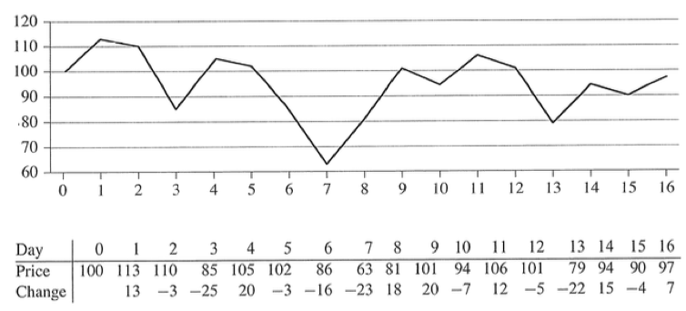
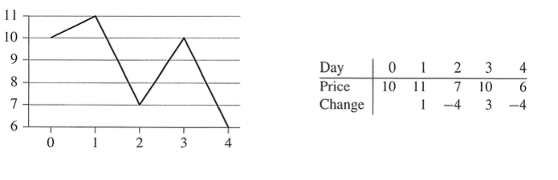

#Divide and Conquer
많은 알고리즘은 재귀적으로 나타내어진다. 하나의 problem이 주어질 때, 호출된 함수는 한번에 그 문제를 해결하기 보다는 자기 자신을 반복해서 호출해 원래 문제보다 작은 규모의 문제를 풀게 한다. 이 작은 문제들의 해를 조합해 원래 문제의 해를 구해낼 수 있다. 이를 divide-and-conquer approach라고 한다.  

- Divide : 주어진 문제를 몇 개의 부분문제로 나눈다.  
- Conquer : 부분 문제를 푼다. 부분 문제의 크기가 충분히 작으면 직접 계산해 해를 구한다.  
- Combine : 부분 문제들의 해를 조합해 원래 문제의 해를 구한다.

###Merge Sort
- Divide : n개의 요소를 가진 배열을 n/2개의 요소를 가진 두 개의 배열로 나눈다.
- Conquer : 두 개의 배열을 'merge sort'로 정렬한다.
- Combine : 정렬된 두 배열을 합쳐 정렬된 새로운 배열을 만든다.  

###Recurrence Equation
재귀적 알고리즘은 recurrence equation으로 계산량을 표현할 수 있다. (재귀적 알고리즘이란, 재귀함수를 이용한다는 것이 아니라 recursive하다는 것)  
Recurrence equation은 다음과 같은 형식을 가진다.  
  

merge sort의 경우는,  


  
##The maximum-subarray problem
  

위 그림은 주가 변화를 나타내는 그래프이다. 언제 사고 언제 팔아야 이익이 최대가 될까? 주가가 최저일 때 사서 최대일 때 팔면 된다고 생각할 수 있지만 위 그래프에서 최고점은 최저점보다 전에 나타나기 때문에 불가능하다. 또한, 다음 그림에서 알 수 있듯이 우리가 원하는 답은 최고점이나 최저점과는 관련이 없다.  



###Brute force
가능한 모든 경우의 수를 비교한다. O(n^2)

###Transformation
입력으로서 '주가의 변화'를 받는다고 생각할 수 있다. 즉, [13, -3, -25, 20, -3, -16, -23, 18, 20, -7, 12, -5, -22, 15, -4, 7]이 입력값이 된다. 이 때, 이익이 최대가 되는 구간을 구하는 것은 합이 최대가 되는 부분배열을 구하는 것과 같다. 여기서는 [18, 20, -7, 12]가 그 답이 된다. 이 부분배열을 maximum subarray라고 한다.

###Divide-and-conquer approach
maximum-subarray problem을 divide-and-conquer의 방식으로 풀어보자. 우리는 배열 A[low .. high]를 가지고 있다. 이 배열을 두 개의 부분배열 A[low .. mid], A[mid+1 .. high]로 나누어 생각할 수 있다. 원래의 배열 A[low .. high]의 임의의 부분 배열 A[i .. j]는 반드시 다음 세가지 경우 중 하나에 속한다.

- A[low .. mid]에 포함된다. 즉 low <= i <= j <= mid
- A[mid+1 .. high]에 포함된다. 즉 mid < i <= j <= high
- 중간점을 지난다. 즉 low <= i <= mid j <= high

따라서 우리는 위의 세가지 경우의 해를 각각 구한 후 그 중 합이 최대가 되는 부분배열을 고르면 maximum subarray를 얻을 수 있다. 일단, 세번째 경우의 알고리즘을 생각해보자.


```
Function FNID-MAX-CROSSING-SUBARRAY(A, low, mid, high)
	left_sum = -무한대
	sum = 0
	for i = mid downto low
		sum = sum + A[i]
		if sum > left_sum
			left_sum = sum
			max_left = i
	right_sum = -무한대
	sum = 0
	for j = mid + 1 to high
		sum = sum + A[j]
		if sum > right_sum
			right_sum = sum
			max_right = j
	return (max_left, max_right, left_sum + right_sum)
```

우리는 maximum subarray가 mid를 지난다는 것을 가정하고 있다. 그러므로 mid에서부터 low까지 검사하면서 합이 최대가 되는 지점, mid에서부터 high까지 합이 최대가 되는 지점을 각각 구해 합치면 maximum subarray가 구해진다. 이는 선형시간 안에 종료된다.  

세번째 경우일 때의 알고리즘을 알았으니 원래 문제로 돌아가 생각해보자. 첫 번째 경우와 두 번째 경우는 원래 문제와 똑같은 문제이다. 다만 배열의 크기가 작아졌을 뿐이다. 그러므로 각각의 경우의 알고리즘을 생각하려 노력하지 않아도 하나의 함수만으로 풀 수 있다(recursively!).

```
Function FIND-MAXIMUM-SUBARRAY(A, low, high)
	if high == low
		return (low, high, A[low])
	else mid = (low+high)/2
		(left_low, left_high, left_sum) =
			FIND-MAXIMUM-SUBARRAY(A, low, mid)
		(right_low, right_high, right_sum) =
			FIND-MAXIMUM-SUBARRAY(A, mid+1, high)
		(cross_low, cross_high, cross_sum) = 
			FIND-MAX-CROSSING-SUBARRAY(A, low, mid, high)
			
		if left_sum >= right_sum && left_sum >= cross_sum
			return (left_low, left_high, left_sum)
		else if right_sum >= left_sum && right_sum >= cross_sum
			return (rgiht_low, right_high, right_sum)
		else
			return (cross_low, cross_high, cross_sum)
```
